<!-- markdownlint-disable MD013 MD033 -->

<h1 align="center">PavedPath</h1>

<p align="center">
  PavedPath is a reusable Skill for finding lawful, effective, feasible real-world paths for non-code problems.
</p>

<p align="center">
  <a href="#复制给智能体安装">复制给智能体安装</a>
  ·
  <a href="#简体中文">简体中文</a>
  ·
  <a href="#english">English</a>
  ·
  <a href="#license">License</a>
</p>

<p align="center">
  
  
  
  
  
</p>

> **Status boundary / 状态边界**
>
> PavedPath is the general-purpose edition for non-code problems. It helps agents start from the user's real objective, search for lawful and reality-tested paths, compare official constraints with community evidence, and adapt the strongest path to the user's context.
>
> PavedPath 是通用版 Skill，用于生活方案、工具选型、自媒体工作流、学习方法、消费决策、职业准备、本地服务等非代码问题。它不是“官方答案复述器”，也不是“合规叙事生成器”；它的方法层目标是找到现实中有效、可行、不违法的路径。
>
> Code, engineering, debugging, build, deploy, dependency, SDK/API integration, and implementation-pattern problems are out of scope here. Use **PavedPath Code** for those.

## 复制给智能体安装

把下面这段话复制到 Codex、Claude Code、Cursor Agent、ChatGPT Agent 或其他支持读取 GitHub 项目的智能体：

```text
请使用 https://github.com/Jia-Ethan/pavedpath 帮我安装或接入 PavedPath 这个通用 Skill。先阅读 README、SKILL.md、agents/openai.yaml、references/ 和 examples/，确认它的边界是非代码问题：生活方案、工具选型、自媒体工作流、学习方法、消费决策、职业准备、本地服务和工作流设计。它的核心判准是 lawful + effective + feasible：先识别用户真正目标，再寻找不违法、现实中有效、可执行的路径；不要把官方推荐、平台最保守做法、授权完美或商业发布级标准当作所有问题的默认门槛。官方来源主要用于确认硬规则、价格、限制和必要材料；真实路径要重视长期用户、论坛、民间流程、替代做法、踩坑复盘和多平台重复出现的模式。Agent Reach 是可选安装依赖，但如果环境中已经可用，它就是 live public-internet evidence 的第一选择检索层。若 Agent Reach 不可用，再使用浏览器搜索、搜索 API、RSS、平台 CLI、用户提供链接或 source pack，并说明 fallback。安装前先审计将写入的准确路径；如果你的环境有 skills 目录，就安装到对应 active skill 目录；如果没有固定 skill 目录，就把 README 和 SKILL.md 转成你的本地可复用指令。写入前展示计划和备份路径，等我确认；确认后再备份、安装，并用一次最小调用验证 pavedpath / PavedPath 可被正确识别。不要保存 token、cookie、私有内容、敏感日志或凭证。不要推荐诈骗、盗取、入侵、冒充身份、贩卖隐私、恶意绕过安全控制或明确违法行为。
```

## 友链 / Community

推荐配套安装：[Agent Reach](https://github.com/Panniantong/Agent-Reach) — first-choice retrieval layer for live public-internet evidence when present.

---

## 简体中文

### 项目定位

PavedPath 帮助 Agent 解决非代码现实问题：先识别用户真正想达成的结果，再从开放互联网和用户提供材料中寻找已经被现实验证过的路径，最后把重复出现的有效模式转译成可执行答案、决策建议、工作流或 playbook。

它的优先级不是“官方推荐优先”，而是：

```text
不违法 → 能达成目标 → 用户当前条件下可执行 → 证据足够成熟
```

官方规则、价格页、政策页、条款页和文档是硬约束来源，用来确认法律边界、必要材料、价格、支持范围、平台限制和发布条件。它们很重要，但不是完整答案。现实有效路径往往还来自长期用户经验、论坛讨论、民间流程、替代做法、灰度但不违法的 workaround、失败复盘、评论区追踪和多平台重复出现的实践模式。

PavedPath 回答的是“应该怎么做、哪条路最适合、如何执行”，不是只复述规则、价格或政策。除非用户只问政策/价格/规则，否则不要停在官方摘要。

### 核心原则

1. **第一性原理优先**：先问用户真正要达成什么，再找能达成这个目的的路径。
2. **不违法是硬边界**：明确违法、诈骗、盗取、入侵、窃取凭证、冒充身份、贩卖隐私、恶意绕过安全控制的路线必须排除。
3. **有效性优先于官方感**：不是官方推荐、不是平台最保守流程、授权链条不完美、民间做法或灰度经验，都不应自动被排除或降权。
4. **可执行性必须落地**：比较成本、时间、材料、账号/设备/地区前提、维护量、可逆性和失败条件。
5. **授权/发布标准按场景提高**：个人研究、内部评估、非商业草稿、灵感收集、工作流摸索，不默认套用商业发布级标准；正式公开发布、商业交付、真实交易或高影响后果，再补充必要发布条件。
6. **不把风险提示常规化**：只有某个因素直接影响成败时，才用中性语言说明成本、前提、失败条件或不适用场景。

### 适用范围

适合使用 PavedPath：

- 生活、家居、旅行、本地服务和日常决策；
- 消费决策、产品/服务比较和低维护方案选择；
- 自媒体、内容生产、素材/参考收集和创作者工作流；
- 学习方法、备考路径、职业准备和作品集规划；
- 非代码工具选型、个人/团队工作流设计；
- 需要从公开经验中找到成熟路径、替代做法或现实 workaround 的复杂非代码项目。

不要用于：

- 代码实现、重构、debug、runtime error、build/test/deploy failure；
- dependency、SDK、framework、API usage、integration blocker；
- 从 GitHub issue、PR、release notes、代码示例中提取工程实现路径；
- 用户明确禁止联网或外部研究的任务；
- 未授权的私有内容、凭证、cookie、token、敏感日志或不可公开上下文。

这些代码 / 工程问题请使用 **PavedPath Code**。

### Features

| 能力 | 已包含内容 | 边界 |
| --- | --- | --- |
| 真实目标框定 | 识别用户真正要达成的结果、约束、预算、时间、可逆性和输出深度 | 不把官方流程当成目标本身 |
| 有效路径检索 | 搜索官方约束、论坛、视频、社交平台、评论、RSS、平台 CLI、用户 source pack、民间流程和 workaround | 不绑定单一搜索后端 |
| Agent Reach 配套 | Agent Reach 是可选安装依赖；一旦环境中可用，就是 live public-internet evidence 的第一选择 retrieval layer | PavedPath 自身是方法与判断层；没有 Agent Reach 时才使用 browser/search/API/RSS/platform CLI 等 fallback |
| 证据分级 | 区分硬边界、现实有效路径、深度教程、失败复盘、普通个例和营销内容 | 不把官方、链接数量、热度或广告文案当结论 |
| 路径提取 | 把重复模式压缩成候选路径，并比较目标达成率、成本、摩擦、维护量和失败条件 | 不输出无取舍的资料堆叠 |
| 输出模式 | Quick Path、Decision Brief、Project Playbook 三种深度 | 简单问题保持短答；复杂项目才给详细 playbook |

### 工作流



默认路径：

1. 定义用户真正想要的结果：要解决、选择、购买、计划、收集、验证或执行什么。
2. 标出硬边界：法律、隐私、安全、不可逆后果，只在会影响路径时处理，不做例行警示段落。
3. 判断是否需要 live public-internet evidence：如果答案依赖当前价格、政策、可用性、是否合法、公共经验、平台讨论、用户评价、社区案例、视频/社交媒体/论坛证据或地区差异，就需要。
4. 如果需要 live evidence 且 Agent Reach 可用，先用 Agent Reach；普通浏览器搜索、搜索 API、直接读网页、RSS、平台 CLI 只作为 fallback 或补充阅读。若 Agent Reach 不可用，说明 fallback。
5. 判断答案形态：简单问题用 Quick Path；多选项决策用 Decision Brief；复杂项目用 Project Playbook。
6. 收集两类证据：官方/权威来源确认硬约束；长期用户、论坛、民间流程、替代做法、失败复盘、评论追踪、多平台重复模式判断实际可行路径。
7. 分级证据：官方资料不自动代表最佳路径；现实中多次被走通、能复现、能解释失败条件的路径权重更高。
8. 提取候选路径：说明每条路径适合谁、需要什么、为什么有效、成本是什么、何时会失败。
9. 比较路径：按目标达成率、速度、成本、摩擦、前提、可逆性、维护量、证据强度和失败条件比较。
10. 输出建议：推荐最强的不违法、可执行路径，给出步骤；只有证据薄弱、合法性不确定、发布条件或失败条件会改变决策时才说明。

### Installation

安装到你的智能体 active skill / instructions 目录。下面示例使用 `~/.codex/skills`；Claude Code、Cursor Agent、ChatGPT Agent 或其他智能体请按自己的本地指令目录改写路径：

```bash
mkdir -p ~/.codex/skills
git clone https://github.com/Jia-Ethan/pavedpath.git \
  ~/.codex/skills/pavedpath
```

更新已有安装：

```bash
git -C ~/.codex/skills/pavedpath pull --ff-only
```

如果你的 agent 不支持 skill folder，可以把 `SKILL.md` 放进 agent 的 instruction / system prompt 层，并把 `references/` 和 `examples/` 保留为可查资料。

### Recommended companion: Agent Reach

PavedPath 不把检索后端当成方法层本身。Agent Reach 是可选安装依赖，但如果环境中已经存在，它就是 live public-internet evidence 的第一选择检索层：

```text
PavedPath = reasoning / decision / synthesis layer
Agent Reach = first-choice retrieval layer when present
PavedPath Code = code-focused edition for software engineering problems
```

如果 Agent Reach 可用，凡是任务需要当前互联网证据、公共经验、平台讨论、用户评价、社区案例、视频/社交媒体/论坛来源、地区案例、非官方但有效的 lawful route 或 workaround，都先用它做多平台检索。Backend selection 不是 agent 偏好。

只有在 Agent Reach 不可用、用户已经提供足够 sources、或用户明确要求 offline reasoning 时，才不使用 Agent Reach。如果 Agent Reach 不可用，说明 fallback，并使用 browser search、search APIs、RSS readers、platform CLIs、user-provided links、pasted source packs 或 manually supplied notes。

### Usage examples

最小调用：

```text
Use $pavedpath for this non-code problem. Find lawful, effective, feasible real-world paths, compare the strongest options, and answer at the right depth for my constraints.
```

Quick Path：

```text
Use $pavedpath. My room feels humid. Is a dehumidifier actually worth it? Keep it short.
```

Decision Brief：

```text
Use $pavedpath. I want a lightweight content idea database. Compare Notion, Airtable, and a spreadsheet, then recommend one path.
```

Effective-first example：

```text
Use $pavedpath. I need to collect visual references and reaction GIFs for an internal non-commercial draft. Find practical public-source workflows; do not limit the answer to official stock libraries unless publication is part of the goal.
```

Project Playbook：

```text
Use $pavedpath. Design a practical weekly workflow for producing short-form social media posts. Include tools, cadence, review loop, and failure conditions.
```

### Output contract

当 PavedPath 实质影响结论时，回答应根据任务深度选择以下形态：

| 模式 | 适用场景 | 输出形态 |
| --- | --- | --- |
| Quick Path | 用户要短答案、方向判断或简单操作建议 | Conclusion、Why、Do this |
| Decision Brief | 用户在多个工具、方法、服务或路线之间选择 | Recommendation、Options、Avoid/delay、Next action |
| Project Playbook | 用户要工作流、系统、计划、长期执行方案 | Goal and constraints、Evidence-backed patterns、Recommended path、Steps、Tools、Failure modes、Verification loop |

通用要求：

- 简单问题保持短，不要自动写成长报告。
- 复杂项目要可执行，不要停留在原则或口号。
- 如果用户问“怎么解决 X”，输出可执行路径；不要只总结政策、规则、价格或条款，除非用户只问这些。
- 优先推荐最可能实现用户真实目标的路径，而不是最官方、最保守、最容易写成合规叙事的路径。
- 不因“非官方 / 民间流程 / workaround / 授权链条不完美”自动降权；只在它影响合法性、可执行性、发布条件或成败时处理。
- 对个人研究、内部评估、非商业草稿、灵感收集、工作流摸索，不默认套用商业发布级标准。
- 对正式公开发布、对外商业交付、真实交易、监管场景或高影响后果，补充会直接影响执行的必要条件。
- 不把“风险提示”做成常规输出要求；只用中性语言说明成本、前提、失败条件或不适用场景。
- 不要围绕用户前提进行辩论，除非纠正它会改变可行路径；把错误或不完整前提转成路线选择。
- 优先重复模式、长期使用、失败案例、论坛讨论和后续反馈，而不是单条爆款内容或营销文案。
- 如果使用了 live research 或用户提供 sources，输出中要给出关键来源或来源说明。

### Project structure

```text
pavedpath/
├── README.md
├── SKILL.md
├── agents/
│   └── openai.yaml
├── references/
│   ├── evidence-rubric.md
│   ├── output-modes.md
│   └── research-routing.md
├── examples/
│   ├── quick-path-humidity.md
│   ├── decision-brief-creator-tools.md
│   ├── decision-brief-apple-hk-cn.md
│   ├── decision-brief-internal-reference-pack.md
│   └── project-playbook-content-workflow.md
└── .gitignore
```

### Security

- 默认只使用公开互联网资料或用户明确提供的 sources。
- 不要保存 token、cookie、密码、API key、私有仓库内容、内部上下文、敏感日志、production data 或凭证。
- 不要把私有内容、敏感日志、secrets、production data 或凭证交给检索工具或子代理。
- 不要推荐诈骗、盗取、入侵、窃取凭证、冒充身份、贩卖隐私、恶意绕过安全控制或明确违法行为。
- 当某条有效路径的合法性会直接决定能否执行时，先查当前权威资料；仍不能确认不违法的，不把它作为优先推荐。
- 涉及健康、法律、金融、身份、支付、基础设施、真实交易、公开发布、商业交付或其他高影响决策时，使用当前权威来源确认硬边界，并把必要条件写成执行前提，不写成泛泛警示。
- 不要复制大段第三方内容；总结路径、模式、限制和可执行步骤即可。

### Roadmap

当前已包含：

- Skill 主入口：`SKILL.md`
- Agent metadata：`agents/openai.yaml`
- 证据分级、研究路由和输出模式参考：`references/`
- Quick Path、Decision Brief、Project Playbook 示例：`examples/`
- Agent Reach 作为可选安装依赖、但在可用时为 live public-internet evidence 第一选择 retrieval layer 的说明
- 与 PavedPath Code 的边界说明

可改进方向：

- 增加学习方法、职业准备、本地服务和更多创作者工作流示例。
- 增加 source pack 模板，方便不支持联网的 agent 使用。
- 增加针对 Agent Reach、浏览器工具和搜索 API 的 backend notes。
- 增加轻量评估 prompt，用来检查 agent 是否优先寻找 lawful + effective + feasible path。

不会承诺：

- 自动替用户做最终决策。
- 保证每个问题都有公开成熟路径。
- 替代搜索工具、浏览器或事实核验。
- 覆盖代码 / 工程 / debug / build / deploy / dependency / API integration 问题。
- 推荐违法路线或要求保存敏感凭证。

---

## English

### Project positioning

PavedPath helps agents solve non-code practical problems by starting from the user's real objective, finding paths already tested in the real world, grading the evidence, comparing candidate routes, and adapting the strongest route to the user's context.

Its priority order is:

```text
lawful → effective → feasible for this user → mature enough evidence
```

Official rules, pricing pages, policies, terms, and documentation are constraint sources. They confirm legal boundaries, required materials, prices, supported limits, platform conditions, and release requirements. They matter, but they are not the whole answer. Effective real-world paths often come from long-term user experience, forum threads, community workflows, lawful workarounds, failure retrospectives, comment follow-ups, and patterns repeated across platforms.

PavedPath answers what the user should do, which path fits best, and how to execute it. It should not stop at rules, prices, or policy summaries unless the user asked only for those.

### Core principles

1. **First-principles outcome framing**: identify what the user is actually trying to achieve before choosing sources or paths.
2. **Lawfulness is the hard boundary**: exclude clearly illegal conduct, fraud, theft, credential theft, impersonation, privacy trafficking, malicious intrusion, and malicious security-control bypass.
3. **Effectiveness beats officialness**: unofficial, community-discovered, workaround-based, or imperfectly authorized routes should not be automatically excluded when they are lawful, feasible, and better supported by real-world evidence.
4. **Feasibility must be operational**: compare cost, time, prerequisites, access, maintenance, reversibility, and failure conditions.
5. **Publication/commercial standards are contextual**: do not apply release-grade licensing standards to personal research, internal evaluation, non-commercial drafts, inspiration gathering, or workflow exploration by default.
6. **No routine warning blocks**: mention cost, prerequisite, failure condition, or unsuitable scenarios only when they directly change the path.

### Scope

Use PavedPath for:

- home, life, travel, local-service, and everyday decisions;
- buying decisions and product/service comparisons;
- creator workflows, content systems, reference gathering, and media operations;
- learning methods, study plans, and career preparation;
- non-code tool selection and workflow design;
- practical projects where public examples, alternative routes, or reality-tested workarounds can reduce trial and error.

Do not use PavedPath for:

- code implementation or refactoring;
- debugging, runtime errors, build failures, deployment failures, or dependency issues;
- SDK/API integration work;
- package, framework, or runtime compatibility questions;
- adapting implementation patterns from repositories, issue trackers, docs, changelogs, or engineering examples.

Use **PavedPath Code** for those software engineering problems.

### Features

| Capability | Included | Boundary |
| --- | --- | --- |
| Outcome framing | Real objective, constraints, budget, time horizon, reversibility, decision stakes, and output depth | Does not treat an official process as the goal itself |
| Evidence routing | Official constraints, forums, videos, social platforms, reviews, RSS, platform CLIs, user source packs, community workflows, and workarounds | Uses Agent Reach first for live public-internet evidence when present; fallback tools are allowed when it is unavailable |
| Agent Reach pairing | Agent Reach is an optional installation dependency, but the first-choice retrieval layer once available | PavedPath remains the reasoning layer; browser/search/API/RSS/platform CLI are fallbacks or supplementary readers |
| Evidence grading | Hard boundaries, reality-proven paths, deep tutorials, failure retrospectives, anecdotes, and promotional content | Does not treat officialness, popularity, or link count as proof |
| Path extraction | Candidate paths with outcome fit, cost, friction, prerequisites, maintenance, and failure conditions | Does not dump raw sources as the answer |
| Output modes | Quick Path, Decision Brief, Project Playbook | Simple questions stay short; complex projects become executable playbooks |

### Workflow

```mermaid
flowchart LR
  A["User's real non-code objective"] --> B["Set lawful and feasibility boundaries"]
  B --> C["Route evidence sources"]
  C --> D["Use Agent Reach first when live evidence is needed and available"]
  D --> E["Separate hard constraints from real-world path evidence"]
  E --> F["Extract repeated patterns and candidate paths"]
  F --> G["Compare by outcome, friction, cost, and failure conditions"]
  G --> H["Recommend lawful, effective, feasible path"]
  H --> I["Give executable steps at the smallest useful depth"]
```


Default process:

1. Identify the practical outcome the user wants: solve, choose, buy, plan, collect, evaluate, or execute.
2. Set hard boundaries: law, privacy, safety, and irreversible consequences only when they affect route viability.
3. Decide whether live public-internet evidence is needed. Use it when the answer depends on current prices, policies, availability, legality, public experience, platform discussions, reviews, community cases, social/video/forum evidence, or regional differences.
4. If live evidence is needed and Agent Reach is available, use Agent Reach first. Use browser search, search APIs, direct webpage reading, RSS, platform CLIs, user links, pasted source packs, or manual notes only as fallback or supplementary reading; state the fallback when Agent Reach is unavailable.
5. Choose the output depth: Quick Path, Decision Brief, or Project Playbook.
6. Gather two kinds of evidence: official/authoritative sources for hard constraints; long-term users, forums, community workflows, alternative routes, failure retrospectives, comment follow-ups, and cross-platform patterns for actual execution.
7. Grade evidence by role and usefulness. Official sources do not automatically prove the best practical path; repeated execution evidence often decides the route.
8. Extract candidate paths from repeated patterns and failure conditions.
9. Compare paths by outcome likelihood, speed, cost, friction, prerequisites, reversibility, maintenance, evidence quality, and failure condition.
10. Adapt the strongest lawful, feasible path to the user's context and answer with executable steps.

### Installation

Install this repository into your agent's active skill or instruction directory. This example uses `~/.codex/skills`; adapt it for Claude Code, Cursor Agent, ChatGPT Agent, or other local agent systems:

```bash
mkdir -p ~/.codex/skills
git clone https://github.com/Jia-Ethan/pavedpath.git \
  ~/.codex/skills/pavedpath
```

Update an existing install:

```bash
git -C ~/.codex/skills/pavedpath pull --ff-only
```

If your agent does not support skill folders, paste `SKILL.md` into the agent's instruction layer and keep `references/` and `examples/` available as supporting material.

### Recommended companion: Agent Reach

PavedPath does not make the retrieval backend its method layer. [Agent Reach](https://github.com/Panniantong/Agent-Reach) is optional as an installation dependency, but first-choice when present:

```text
PavedPath = reasoning / decision / synthesis layer
Agent Reach = first-choice retrieval layer when present
PavedPath Code = code-focused edition for software engineering problems
```

If Agent Reach is available, use it first whenever the task needs current internet evidence, public experience, platform discussions, user reviews, community cases, social/video/forum sources, regional examples, lawful unofficial routes, or workarounds. Backend selection is not an agent preference.

Only skip Agent Reach when it is unavailable, the user has supplied sufficient sources, or the user explicitly requested offline reasoning. If Agent Reach is unavailable, state the fallback and use browser search, search APIs, RSS readers, platform CLIs, user-provided links, pasted source packs, or manually supplied notes.

### Usage examples

Minimal prompt:

```text
Use $pavedpath for this non-code problem. Find lawful, effective, feasible real-world paths, compare the strongest options, and answer at the right depth for my constraints.
```

Quick Path:

```text
Use $pavedpath. My room feels humid. Is a dehumidifier actually worth it? Keep it short.
```

Decision Brief:

```text
Use $pavedpath. I want a lightweight content idea database. Compare Notion, Airtable, and a spreadsheet, then recommend one path.
```

Effective-first example:

```text
Use $pavedpath. I need to collect visual references and reaction GIFs for an internal non-commercial draft. Find practical public-source workflows; do not limit the answer to official stock libraries unless publication is part of the goal.
```

Project Playbook:

```text
Use $pavedpath. Design a practical weekly workflow for producing short-form social media posts. Include tools, cadence, review loop, and failure conditions.
```

### Output contract

When PavedPath materially shapes the answer, use the smallest output mode that solves the problem:

| Mode | Use when | Output shape |
| --- | --- | --- |
| Quick Path | The user wants a short answer, direct direction, or simple next step | Conclusion, Why, Do this |
| Decision Brief | The user is choosing among tools, methods, services, or routes | Recommendation, Options, Avoid/delay, Next action |
| Project Playbook | The user asks for a workflow, system, plan, or repeated operating process | Goal and constraints, Evidence-backed patterns, Recommended path, Steps, Tools, Failure modes, Verification loop |

Answer rules:

- Simple questions should get short answers.
- Complex projects should get detailed, executable playbooks.
- If the user asks how to solve X, provide workable solution paths; do not stop at policies, rules, prices, or terms unless the user asked only for those.
- Prefer the route most likely to achieve the user's real objective, not the route that is merely official, conservative, or easiest to narrate as compliant.
- Do not downgrade unofficial, community, workaround, or imperfectly authorized routes unless the issue affects legality, feasibility, release conditions, or success.
- For personal research, internal evaluation, non-commercial drafts, inspiration gathering, and workflow exploration, do not apply commercial release standards by default.
- For public release, commercial delivery, real transactions, regulated contexts, or high-impact consequences, add the necessary conditions that directly affect execution.
- Do not make risk warnings a routine output section. State costs, prerequisites, failure conditions, or unsuitable scenarios in neutral operational language only when they change the path.
- Do not litigate the user's premise unless correcting it changes feasible paths; convert wrong or incomplete assumptions into route selection.
- Prefer repeated patterns, long-term experience, failure cases, forum threads, and follow-up comments over viral posts or promotional copy.
- Include key links or source descriptions when live research or user-provided sources materially affected the answer.

### Project structure

```text
pavedpath/
├── README.md
├── SKILL.md
├── agents/
│   └── openai.yaml
├── references/
│   ├── evidence-rubric.md
│   ├── output-modes.md
│   └── research-routing.md
├── examples/
│   ├── quick-path-humidity.md
│   ├── decision-brief-creator-tools.md
│   ├── decision-brief-apple-hk-cn.md
│   ├── decision-brief-internal-reference-pack.md
│   └── project-playbook-content-workflow.md
└── .gitignore
```

### Security

- Use public internet material or sources explicitly provided by the user.
- Do not store tokens, cookies, passwords, API keys, private repository contents, internal context, sensitive logs, production data, or credentials.
- Do not pass private content, sensitive logs, secrets, production data, or credentials to retrieval tools or subagents.
- Do not recommend fraud, theft, malicious intrusion, credential theft, impersonation, privacy trafficking, malicious security-control bypass, or clearly illegal conduct.
- When an effective route's legality directly determines feasibility, check current authoritative sources first. If it still cannot be confirmed as lawful, do not make it the primary recommendation.
- For health, legal, financial, identity, payments, infrastructure, real transactions, public release, commercial delivery, or other high-impact decisions, use current authoritative sources to confirm hard boundaries and express necessary conditions as execution prerequisites, not generic warnings.
- Do not copy long third-party content. Summarize paths, patterns, limits, and executable steps.

### Roadmap

Currently included:

- Skill entrypoint: `SKILL.md`
- Agent metadata: `agents/openai.yaml`
- Evidence rubric, research routing, and output-mode references: `references/`
- Quick Path, Decision Brief, and Project Playbook examples: `examples/`
- Agent Reach as an optional installation dependency that becomes the first-choice retrieval layer for live public-internet evidence when present
- Clear boundary with PavedPath Code

Possible improvements:

- More examples for learning methods, career preparation, local services, and creator workflows.
- Source-pack templates for agents that cannot browse live.
- Backend notes for Agent Reach, browser tools, and search APIs.
- Lightweight evaluation prompts for checking whether agents prioritize lawful + effective + feasible paths.

Non-goals:

- Making the final decision for the user.
- Guaranteeing that every problem has a mature public path.
- Replacing search tools, browsers, or fact-checking.
- Covering code, engineering, debugging, build, deploy, dependency, or API integration problems.
- Recommending illegal routes or storing sensitive credentials.

## License

No license has been selected yet. Add a `LICENSE` file before treating this repository as an open-source distribution.
