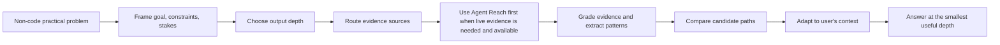

<!-- markdownlint-disable MD013 MD033 -->

<h1 align="center">PavedPath</h1>

<p align="center">
  PavedPath is a reusable Skill for turning open-internet evidence into practical paths for non-code problems.
</p>

<p align="center">
  <a href="#复制给智能体安装">复制给智能体安装</a>
  ·
  <a href="#简体中文">简体中文</a>
  ·
  <a href="#english">English</a>
  ·
  <a href="#license">License</a>
</p>

<p align="center">
  
  
  
  
  
</p>

> **Status boundary / 状态边界**
>
> PavedPath is the general-purpose edition for non-code problems. It helps agents find mature public-internet approaches, filter evidence, compare practical paths, and adapt the strongest path to the user's constraints.
>
> PavedPath 是通用版 Skill，用于生活方案、工具选型、自媒体工作流、学习方法、消费决策、职业准备、本地服务等非代码问题。它不是“搜索工具包装器”，而是把开放互联网中的成熟经验转译成可执行路径的方法层。
>
> Code, engineering, debugging, build, deploy, dependency, SDK/API integration, and implementation-pattern problems are out of scope here. Use **PavedPath Code** for those.

## 复制给智能体安装

把下面这段话复制到 Codex、Claude Code、Cursor Agent、ChatGPT Agent 或其他支持读取 GitHub 项目的智能体：

```text
请使用 https://github.com/Jia-Ethan/pavedpath 帮我安装或接入 PavedPath 这个通用 Skill。先阅读 README、SKILL.md、agents/openai.yaml、references/ 和 examples/，确认它的边界是非代码问题：生活方案、工具选型、自媒体工作流、学习方法、消费决策、职业准备、本地服务和工作流设计。它不是搜索工具，也不是代码版；代码、工程、debug、build、deploy、dependency、SDK/API integration 和实现模式问题请交给 PavedPath Code。Agent Reach 是可选安装依赖，但如果环境中已经可用，它就是 live public-internet evidence 的第一选择检索层；不要把 backend selection 当成 agent 偏好。若 Agent Reach 不可用，再使用浏览器搜索、搜索 API、RSS、平台 CLI、用户提供链接或 source pack，并说明 fallback。安装前先审计将写入的准确路径；如果你的环境有 skills 目录，就安装到对应 active skill 目录；如果没有固定 skill 目录，就把 README 和 SKILL.md 转成你的本地可复用指令。写入前展示计划和备份路径，等我确认；确认后再备份、安装，并用一次最小调用验证 pavedpath / PavedPath 可被正确识别。不要保存 token、cookie、私有内容、敏感日志或凭证。
```

## 友链 / Community

推荐配套安装：[Agent Reach](https://github.com/Panniantong/Agent-Reach) — first-choice retrieval layer for live public-internet evidence when present.

---

## 简体中文

### 项目定位

PavedPath 帮助 Agent 避免在非代码问题上从零编造答案。它先定义用户真正的问题、约束和决策成本，再从开放互联网中寻找已经被多人走通的成熟路径：官方约束、长期使用经验、深度评测、失败复盘、论坛讨论、视频教程、社区问答和用户提供的 source pack。最后，它把证据中的重复模式转译成当前场景下可执行的答案、决策建议、工作流或 playbook。

它不是“搜索链接列表”，也不替代搜索工具。Agent Reach / 搜索工具负责取得材料；PavedPath 负责判断、比较、综合和落地。PavedPath 回答的是“应该怎么做、哪条路最适合、如何执行”，不是只复述规则、价格或政策。官方规则、价格页、政策页和条款页是约束条件，不是最终答案。

### 适用范围

适合使用 PavedPath：

- 生活、家居、旅行、本地服务和日常决策；
- 消费决策、产品/服务比较和低维护方案选择；
- 自媒体、内容生产、素材整理和创作者工作流；
- 学习方法、备考路径、职业准备和作品集规划；
- 非代码工具选型、个人/团队工作流设计；
- 需要从公开经验中找到可执行路径的复杂非代码项目。

不要用于：

- 代码实现、重构、debug、runtime error、build/test/deploy failure；
- dependency、SDK、framework、API usage、integration blocker；
- 从 GitHub issue、PR、release notes、代码示例中提取工程实现路径；
- 用户明确禁止联网或外部研究的任务；
- 未授权的私有内容、凭证、cookie、token、敏感日志或不可公开上下文。

这些代码 / 工程问题请使用 **PavedPath Code**。

### Features

| 能力 | 已包含内容 | 边界 |
| --- | --- | --- |
| 非代码问题框定 | 识别真实目标、约束、预算、时间、可逆性和输出深度 | 不把缺失关键信息硬猜成结论 |
| 证据路径选择 | 根据问题类型选择官方资料、论坛、视频、社交平台、评论、RSS、平台 CLI 或用户 source pack | 不绑定单一搜索后端 |
| Agent Reach 配套 | Agent Reach 是可选安装依赖；一旦环境中可用，就是 live public-internet evidence 的第一选择 retrieval layer | PavedPath 自身是方法与判断层；没有 Agent Reach 时才使用 browser/search/API/RSS/platform CLI 等 fallback |
| 证据分级 | 区分官方事实、长期经验、深度评测、失败复盘、普通个例和营销内容 | 不把链接数量、热度或广告文案当结论 |
| 路径提取 | 把重复模式压缩成候选路径，并比较成本、适配度、维护量、风险和失败条件 | 不输出无取舍的资料堆叠 |
| 输出模式 | Quick Path、Decision Brief、Project Playbook 三种深度 | 简单问题保持短答；复杂项目才给详细 playbook |

### 工作流



默认路径：

1. 先定义用户想要的结果：要解决、选择、购买、计划或执行什么。
2. 判断是否需要 live public-internet evidence：如果答案依赖当前价格、政策、可用性、公共经验、平台讨论、用户评价、社区案例、视频/社交媒体/论坛证据或地区差异，就需要。
3. 如果需要 live evidence 且 Agent Reach 可用，先用 Agent Reach；普通浏览器搜索、搜索 API、直接读网页、RSS、平台 CLI 只作为 fallback 或补充阅读。若 Agent Reach 不可用，说明 fallback。
4. 判断答案形态：简单问题用 Quick Path；多选项决策用 Decision Brief；复杂项目用 Project Playbook。
5. 收集足够证据面：官方约束、重复用户经验、失败案例、对比/评测来源、相关地区来源，以及只有在影响路径时才收集的近期价格/库存。
6. 分级证据：官方资料用于确认约束；长期经验、深度评测和失败报告用于判断实际可行路径；降低营销、短期体验和单一轶事权重。
7. 提取候选路径：说明每条路径适合谁、需要什么、成本是什么、何时会失败。
8. 比较路径：按适配度、成本、摩擦、风险、可逆性、维护量、失败条件和证据强度比较。
9. 输出建议：推荐最强路径，给出执行步骤；只有证据薄弱或冲突会改变决策时才强调。

### Installation

安装到你的智能体 active skill / instructions 目录。下面示例使用 `~/.codex/skills`；Claude Code、Cursor Agent、ChatGPT Agent 或其他智能体请按自己的本地指令目录改写路径：

```bash
mkdir -p ~/.codex/skills
git clone https://github.com/Jia-Ethan/pavedpath.git \
  ~/.codex/skills/pavedpath
```

更新已有安装：

```bash
git -C ~/.codex/skills/pavedpath pull --ff-only
```

如果你的 agent 不支持 skill folder，可以把 `SKILL.md` 放进 agent 的 instruction / system prompt 层，并把 `references/` 和 `examples/` 保留为可查资料。

### Recommended companion: Agent Reach

PavedPath 不把检索后端当成方法层本身。Agent Reach 是可选安装依赖，但如果环境中已经存在，它就是 live public-internet evidence 的第一选择检索层：

```text
PavedPath = reasoning / decision / synthesis layer
Agent Reach = first-choice retrieval layer when present
PavedPath Code = code-focused edition for software engineering problems
```

如果 Agent Reach 可用，凡是任务需要当前互联网证据、公共经验、平台讨论、用户评价、社区案例、视频/社交媒体/论坛来源或地区案例，都先用它做多平台检索。Backend selection 不是 agent 偏好。

只有在 Agent Reach 不可用、用户已经提供足够 sources、或用户明确要求 offline reasoning 时，才不使用 Agent Reach。如果 Agent Reach 不可用，说明 fallback，并使用：

- browser search；
- search APIs；
- RSS readers；
- platform CLIs；
- user-provided links；
- pasted source packs；
- manually supplied notes。

### Usage examples

最小调用：

```text
Use $pavedpath for this non-code problem. Find mature public-internet approaches, compare the strongest paths, and answer at the right depth for my constraints.
```

Quick Path：

```text
Use $pavedpath. My room feels humid. Is a dehumidifier actually worth it? Keep it short.
```

Decision Brief：

```text
Use $pavedpath. I want a lightweight content idea database. Compare Notion, Airtable, and a spreadsheet, then recommend one path.
```

Project Playbook：

```text
Use $pavedpath. Design a practical weekly workflow for producing short-form social media posts. Include tools, cadence, review loop, and failure modes.
```

### Output contract

当 PavedPath 实质影响结论时，回答应根据任务深度选择以下形态：

| 模式 | 适用场景 | 输出形态 |
| --- | --- | --- |
| Quick Path | 用户要短答案、方向判断或简单操作建议 | Conclusion、Why、Do this |
| Decision Brief | 用户在多个工具、方法、服务或路线之间选择 | Recommendation、Options、Avoid/delay、Next action |
| Project Playbook | 用户要工作流、系统、计划、长期执行方案 | Goal and constraints、Evidence-backed patterns、Recommended path、Steps、Tools、Failure modes、Verification loop |

通用要求：

- 简单问题保持短，不要自动写成长报告。
- 复杂项目要可执行，不要停留在原则或口号。
- 明确说明证据薄弱、冲突、过期或只来自窄来源时的限制。
- 如果用户问“怎么解决 X”，输出可执行路径；不要只总结政策、规则、价格或条款，除非用户只问这些。
- 不要围绕用户前提进行辩论，除非纠正它会改变可行路径；把错误或不完整前提转成路线选择。
- 优先重复模式、长期使用和失败案例，而不是单条爆款内容或营销文案。
- 如果使用了 live research 或用户提供 sources，输出中要给出关键来源或来源说明。

### Project structure

```text
pavedpath/
├── README.md
├── SKILL.md
├── agents/
│   └── openai.yaml
├── references/
│   ├── evidence-rubric.md
│   ├── output-modes.md
│   └── research-routing.md
├── examples/
│   ├── quick-path-humidity.md
│   ├── decision-brief-creator-tools.md
│   ├── decision-brief-apple-hk-cn.md
│   └── project-playbook-content-workflow.md
└── .gitignore
```

### Security

- 默认只使用公开互联网资料或用户明确提供的 sources。
- 不要保存 token、cookie、密码、API key、私有仓库内容、内部上下文、敏感日志、production data 或凭证。
- 不要把私有内容、敏感日志、secrets、production data 或凭证交给检索工具或子代理。
- 涉及健康、法律、金融、身份、合规、支付、基础设施或其他高影响决策时，要优先使用当前官方来源，并明确适用条件和不确定性。
- 不要复制大段第三方内容；总结路径、模式、限制和可执行步骤即可。

### Roadmap

当前已包含：

- Skill 主入口：`SKILL.md`
- Agent metadata：`agents/openai.yaml`
- 证据分级、研究路由和输出模式参考：`references/`
- Quick Path、Decision Brief、Project Playbook 示例：`examples/`
- Agent Reach 作为可选安装依赖、但在可用时为 live public-internet evidence 第一选择 retrieval layer 的说明
- 与 PavedPath Code 的边界说明

可改进方向：

- 增加学习方法、职业准备、本地服务和更多创作者工作流示例。
- 增加 source pack 模板，方便不支持联网的 agent 使用。
- 增加针对 Agent Reach、浏览器工具和搜索 API 的 backend notes。
- 增加轻量评估 prompt，用来检查 agent 是否选择了正确输出模式。

不会承诺：

- 自动替用户做最终决策。
- 保证每个问题都有公开成熟路径。
- 替代搜索工具、浏览器或事实核验。
- 覆盖代码 / 工程 / debug / build / deploy / dependency / API integration 问题。

---

## English

### Project positioning

PavedPath is the general-purpose edition of the PavedPath skill family. It helps agents solve non-code practical problems by finding mature approaches from the open internet, grading the evidence, comparing candidate paths, and adapting the strongest path to the user's constraints.

It is not a search wrapper. Agent Reach / search and retrieval tools collect material; PavedPath turns internet evidence into practical paths. PavedPath answers what the user should do, which path fits best, and how to execute it. Official rules, prices, policies, and terms are constraints, not the whole solution.

### Scope

Use PavedPath for:

- home, life, travel, local-service, and everyday decisions;
- buying decisions and product/service comparisons;
- creator workflows, content systems, and media operations;
- learning methods, study plans, and career preparation;
- non-code tool selection and workflow design;
- practical projects where public examples can reduce trial and error.

Do not use PavedPath for:

- code implementation or refactoring;
- debugging, runtime errors, build failures, deployment failures, or dependency issues;
- SDK/API integration work;
- package, framework, or runtime compatibility questions;
- adapting implementation patterns from repositories, issue trackers, docs, changelogs, or engineering examples.

Use **PavedPath Code** for those software engineering problems.

### Features

| Capability | Included | Boundary |
| --- | --- | --- |
| Problem framing | Goal, constraints, budget, time horizon, reversibility, decision stakes, and output depth | Does not invent missing high-impact constraints |
| Evidence routing | Official constraints, forums, videos, social platforms, reviews, RSS, platform CLIs, or user source packs | Uses Agent Reach first for live public-internet evidence when present; fallback tools are allowed when it is unavailable |
| Agent Reach pairing | Agent Reach is an optional installation dependency, but the first-choice retrieval layer once available | PavedPath remains the reasoning layer; browser/search/API/RSS/platform CLI are fallbacks or supplementary readers |
| Evidence grading | Official facts, long-term experience, deep reviews, failure reports, anecdotes, and promotional content | Does not treat popularity or link count as proof |
| Path extraction | Candidate paths with fit, cost, effort, maintenance, risk, and failure conditions | Does not dump raw sources as the answer |
| Output modes | Quick Path, Decision Brief, Project Playbook | Simple questions stay short; complex projects become executable playbooks |

### Workflow


Default process:

1. Identify the practical outcome the user wants: solve, choose, buy, plan, or execute.
2. Decide whether live public-internet evidence is needed. Use it when the answer depends on current prices, policies, availability, public experience, platform discussions, reviews, community cases, social/video/forum evidence, or regional differences.
3. If live evidence is needed and Agent Reach is available, use Agent Reach first. Use browser search, search APIs, direct webpage reading, RSS, platform CLIs, user links, pasted source packs, or manual notes only as fallback or supplementary reading; state the fallback when Agent Reach is unavailable.
4. Choose the output depth: Quick Path, Decision Brief, or Project Playbook.
5. Gather enough evidence surfaces: official constraints, repeated user experience, failure cases, comparison/review sources, relevant regional sources, and recent price/availability only when it affects the path.
6. Grade evidence by reliability, independence, recency, methodology, and applicability.
7. Extract candidate paths from repeated patterns and failure modes.
8. Compare paths by fit, effort, cost, friction, maintenance, reversibility, risk, evidence quality, and failure condition.
9. Adapt the strongest path to the user's context and answer with executable steps.

### Installation

Install this repository into your agent's active skill or instruction directory. This example uses `~/.codex/skills`; adapt it for Claude Code, Cursor Agent, ChatGPT Agent, or other local agent systems:

```bash
mkdir -p ~/.codex/skills
git clone https://github.com/Jia-Ethan/pavedpath.git \
  ~/.codex/skills/pavedpath
```

Update an existing install:

```bash
git -C ~/.codex/skills/pavedpath pull --ff-only
```

If your agent does not support skill folders, paste `SKILL.md` into the agent's instruction layer and keep `references/` and `examples/` available as supporting material.

### Recommended companion: Agent Reach

PavedPath does not make the retrieval backend its method layer. [Agent Reach](https://github.com/Panniantong/Agent-Reach) is optional as an installation dependency, but first-choice when present:

```text
PavedPath = reasoning / decision / synthesis layer
Agent Reach = first-choice retrieval layer when present
PavedPath Code = code-focused edition for software engineering problems
```

If Agent Reach is available, use it first whenever the task needs current internet evidence, public experience, platform discussions, user reviews, community cases, social/video/forum sources, or regional examples. Backend selection is not an agent preference.

Only skip Agent Reach when it is unavailable, the user has supplied sufficient sources, or the user explicitly requested offline reasoning. If Agent Reach is unavailable, state the fallback and use browser search, search APIs, RSS readers, platform CLIs, user-provided links, pasted source packs, or manually supplied notes.

### Usage examples

Minimal prompt:

```text
Use $pavedpath for this non-code problem. Find mature public-internet approaches, compare the strongest paths, and answer at the right depth for my constraints.
```

Quick Path:

```text
Use $pavedpath. My room feels humid. Is a dehumidifier actually worth it? Keep it short.
```

Decision Brief:

```text
Use $pavedpath. I want a lightweight content idea database. Compare Notion, Airtable, and a spreadsheet, then recommend one path.
```

Project Playbook:

```text
Use $pavedpath. Design a practical weekly workflow for producing short-form social media posts. Include tools, cadence, review loop, and failure modes.
```

### Output contract

When PavedPath materially shapes the answer, use the smallest output mode that solves the problem:

| Mode | Use when | Output shape |
| --- | --- | --- |
| Quick Path | The user wants a short answer, direct direction, or simple next step | Conclusion, Why, Do this |
| Decision Brief | The user is choosing among tools, methods, services, or routes | Recommendation, Options, Avoid/delay, Next action |
| Project Playbook | The user asks for a workflow, system, plan, or repeated operating process | Goal and constraints, Evidence-backed patterns, Recommended path, Steps, Tools, Failure modes, Verification loop |

Answer rules:

- Simple questions should get short answers.
- Complex projects should get detailed, executable playbooks.
- State when evidence is thin, conflicting, stale, or based on a narrow source set.
- If the user asks how to solve X, provide workable solution paths; do not stop at policies, rules, prices, or terms unless the user asked only for those.
- Do not litigate the user's premise unless correcting it changes feasible paths; convert wrong or incomplete assumptions into route selection.
- Prefer repeated patterns, long-term experience, and failure cases over viral posts or promotional copy.
- Include key links or source descriptions when live research or user-provided sources materially affected the answer.

### Project structure

```text
pavedpath/
├── README.md
├── SKILL.md
├── agents/
│   └── openai.yaml
├── references/
│   ├── evidence-rubric.md
│   ├── output-modes.md
│   └── research-routing.md
├── examples/
│   ├── quick-path-humidity.md
│   ├── decision-brief-creator-tools.md
│   ├── decision-brief-apple-hk-cn.md
│   └── project-playbook-content-workflow.md
└── .gitignore
```

### Security

- Use public internet material or sources explicitly provided by the user.
- Do not store tokens, cookies, passwords, API keys, private repository contents, internal context, sensitive logs, production data, or credentials.
- Do not pass private content, sensitive logs, secrets, production data, or credentials to retrieval tools or subagents.
- For health, legal, financial, identity, compliance, payments, infrastructure, or other high-impact decisions, prefer current official sources and state applicability conditions clearly.
- Do not copy long third-party content. Summarize paths, patterns, limits, and executable steps.

### Roadmap

Currently included:

- Skill entrypoint: `SKILL.md`
- Agent metadata: `agents/openai.yaml`
- Evidence rubric, research routing, and output-mode references: `references/`
- Quick Path, Decision Brief, and Project Playbook examples: `examples/`
- Agent Reach as an optional installation dependency that becomes the first-choice retrieval layer for live public-internet evidence when present
- Clear boundary with PavedPath Code

Possible improvements:

- More examples for learning methods, career preparation, local services, and creator workflows.
- Source-pack templates for agents that cannot browse live.
- Backend notes for Agent Reach, browser tools, and search APIs.
- Lightweight evaluation prompts for checking output-mode selection.

Non-goals:

- Making the final decision for the user.
- Guaranteeing that every problem has a mature public path.
- Replacing search tools, browsers, or fact-checking.
- Covering code, engineering, debugging, build, deploy, dependency, or API integration problems.

## License

No license has been selected yet. Add a `LICENSE` file before treating this repository as an open-source distribution.
